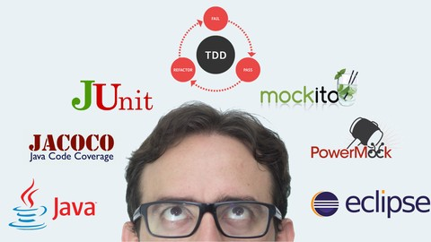

# testes-java-estudos
Repositório de estudos em testes com java, utilizando Junit, Mockito e PowerMock.

# Motivação
Programar com mais qualidade utilizando tecnicas voltadas para testes em princípios voltados para a qualidade e eficiência como o TDD e o F.I.R.S.T

# Imagens

# Tec/framework usados
JDK - 11.0.7, Eclipse, JUnit + Mockito

# Credits
That's the link for the course of my instructor: https://www.udemy.com/course/testes-unitarios-em-java/
